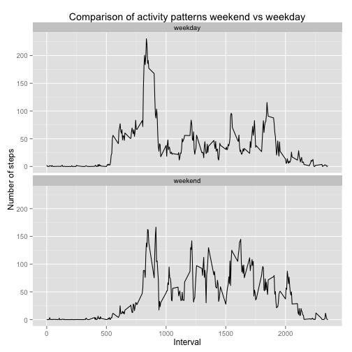

# Reproducible Research: Peer Assessment 1

The purpose of this document is to analyze data obtained from a personal activity monitoring device.

The zipped file containing the data, named *activity.zip*, must be contained in the same directory where the Rmd is placed.
The *plyr* and *ggplot2* packages must be installed.

## Loading and preprocessing the data


```r
if (!file.exists("activity.csv")) {
    unzip("activity.zip")
}
df <- read.csv("activity.csv")
str(df)
```

```
## 'data.frame':	17568 obs. of  3 variables:
##  $ steps   : int  NA NA NA NA NA NA NA NA NA NA ...
##  $ date    : Factor w/ 61 levels "2012-10-01","2012-10-02",..: 1 1 1 1 1 1 1 1 1 1 ...
##  $ interval: int  0 5 10 15 20 25 30 35 40 45 ...
```


Data consist of 17568 observations and 3 variables.

## What is mean total number of steps taken per day?


```r
require(plyr)
```

```
## Loading required package: plyr
```

```r
dfNoNA <- df[!is.na(df$steps), ]
summarizedData <- ddply(dfNoNA, .(date), summarize, sum = sum(steps))
hist(summarizedData$sum, main = "Histogram of total steps for each day", xlab = "Number of steps")
```

 


Looking at the histogram, we see that each day the most frequent number of steps taken is betweek 10000 and 15000.

As required, we report the **mean** and **median** of the total number of steps taken per day:


```r
mean(summarizedData$sum)
```

```
## [1] 10766
```

```r
median(summarizedData$sum)
```

```
## [1] 10765
```


## What is the average daily activity pattern?

Now we are going to build a time series plot of the 5-minute interval and the average number of
steps taken, averaged across all days:


```r
meanByInterval <- ddply(df, .(interval), summarize, mean = mean(steps, na.rm = TRUE))
plot(meanByInterval$interval, meanByInterval$mean, type = "l", main = "Average number of steps per interval", 
    xlab = "Interval", ylab = "Average")
```

 


We see from the plot that the maximum number of steps is taken, on average, in an interval around interval 800/900.
Let's find that interval, and the associated mean value, exactly:


```r
meanByInterval[which(meanByInterval$mean == max(meanByInterval$mean)), ]
```

```
##     interval  mean
## 104      835 206.2
```


## Imputing missing values

The total number of rows with NAs can be found with this snippet of code:

```r
sum(!complete.cases(df))
```

```
## [1] 2304
```


In order do remove all the NAs, we use a quite simple strategy: we replace each NA with the mean of the available values for that interval in the other days.


```r
summarizedDataWithMean <- ddply(dfNoNA, .(interval), summarize, mean = mean(steps))
sum(!complete.cases(summarizedDataWithMean))  #check that at least one value exists for each interval
```

```
## [1] 0
```

```r
# impute.mean <- function(x) replace(x, is.na(x), mean(x, na.rm = TRUE)) df2
# <- ddply(df, ~ interval, transform, steps = round(impute.mean(steps)))
```


See [this link](http://stackoverflow.com/questions/9322773/how-to-replace-na-with-mean-by-subset-in-r-impute-with-plyr) for an explanation of how to replace the NAs with plyr:


```r
impute.mean <- function(x) replace(x, is.na(x), mean(x, na.rm = TRUE))
df2 <- ddply(df, ~interval, transform, steps = round(impute.mean(steps)))
```


So df2 is our normalized dataframe.
We can repeat the same analysis we performed in the first part in order to make a histogram of the total number of steps taken each day and calculate and report the mean and median total number of steps taken per day


```r
summarizedData2 <- ddply(df2, .(date), summarize, sum = sum(steps))
hist(summarizedData2$sum, main = "Histogram of total steps for each day", xlab = "Number of steps")
```

 


The bin between 10000 and 15000 is still the highest; the frequency is biggest because of the increased number of samples after NAs normalization.

As required, we report the **mean** and **median** of the total number of steps taken per day:


```r
mean(summarizedData2$sum)
```

```
## [1] 10766
```

```r
median(summarizedData2$sum)
```

```
## [1] 10762
```


The mean is the same and the median is only slightly changed.

## Are there differences in activity patterns between weekdays and weekends?
In order to do this comparison, we have to create a new factor variable indicating whether the date of the current row corresponds to a week day or a weekend day. We use the *weekdays()* function, setting explicitly the locale so that our analysis is invariant with respect to this variable.


```r
Sys.setlocale("LC_TIME", "C")
```

```
## [1] "C"
```

```r
median(summarizedData2$sum)
```

```
## [1] 10762
```

```r
df2$day <- factor(weekdays(as.Date(df2$date)))
table(df2$day)
```

```
## 
##    Friday    Monday  Saturday    Sunday  Thursday   Tuesday Wednesday 
##      2592      2592      2304      2304      2592      2592      2592
```


Now we have obtained the number of samples available for each day of the week. However our task is to have a two-level factor variable that only differentiates between weekdays and weekend days. We can do this easily with the revalue function from *plyr* package:


```r
df2$day <- revalue(df2$day, c(Monday = "weekday", Tuesday = "weekday", Wednesday = "weekday", 
    Thursday = "weekday", Friday = "weekday", Saturday = "weekend", Sunday = "weekend"))
table(df2$day)
```

```
## 
## weekday weekend 
##   12960    4608
```


Now we have to average the number of steps for each interval over all the days of the sample

```r
df3 <- ddply(df2, .(interval, day), summarize, steps = mean(steps))
```


And finally here are the 2 plots compared:

```r
require(ggplot2)
```

```
## Loading required package: ggplot2
```

```r
g <- ggplot(df3, aes(interval, steps))
g + geom_line() + facet_wrap(~day, ncol = 1) + xlab("Interval") + ylab("Number of steps") + 
    ggtitle("Comparison of activity patterns weekend vs weekday")
```

 


We see that the main difference is in the first part of the morning: during the weekdays on average the number of steps taken is higher, as we can expect.
